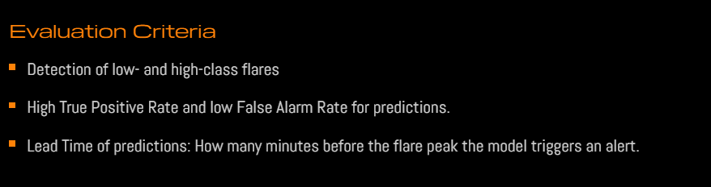

# Aditya-L1 Solar Flare Pipeline & Dashboard



*Generated By Ranadeep Saha. Member of Google Developer Group.*

---

## 🌌 Overview

The **Aditya-L1 Solar Flare Pipeline** is an automated, high-performance algorithm built to ingest, nowcast, and forecast solar flares using time-series data from Aditya-L1's SoLEXS and HEL1OS payloads. It seamlessly integrates a PyTorch-based predictive machine learning backend (`DualHeadLSTM`) with a rich, dynamic, deep-space themed real-time web dashboard.

This end-to-end pipeline includes:
- **Data Ingestion & Preprocessing:** Handles missing values, instrument resets, and standardization.
- **Nowcasting Pipeline:** Employs dynamic background subtraction and derivative-based event triggering to build an enriched Master Flare Catalogue.
- **Forecasting (Machine Learning):** Leverages a robust `DualHeadLSTM` algorithm featuring strict Active Region (AR) data splitting (to prevent leakage) and computes rigorous metrics including True Skill Statistic (TSS), Heidke Skill Score (HSS), and False Alarm Ratios (FAR).
- **Interactive Dashboard:** A beautiful Glassmorphism UI built with Flask and Vanilla JS/CSS that provides real-time light curves (via Chart.js) and probabilistic M/X class flare warnings with robust fallbacks for offline remote APIs.

---

## 🎯 Use Cases

1. **Space Weather Forecasting Centers:** Operational centers can deploy this UI to automatically ingest continuous telemetry and alert operators of incoming M-class and X-class solar flares before they hit peak intensity.
2. **Astrophysics Research:** Researchers analyzing soft and hard X-ray datasets can leverage the programmatic background isolation and event-triggering algorithms to effortlessly generate clean Flare Catalogues from raw Level-1 payload data.
3. **Satellite Protection:** By utilizing the 48-hour probabilistic forecast engine, satellite operators can autonomously enter safe-modes prior to heavy radiation storms.

---

## 🛠️ Installation & Setup

### Prerequisites
Ensure you have Python 3.10+ installed.

### 1. Clone the Repository
```bash
git clone https://github.com/your-username/aditya_l1_flare_pipeline.git
cd aditya_l1_flare_pipeline
```

### 2. Install Dependencies
Install all required Python libraries via `pip`:
```bash
pip install -r requirements.txt
```

### 3. Generate the Machine Learning Model (Optional)
If you wish to retrain the underlying `DualHeadLSTM` forecasting model on your local `merged.csv` dataset, simply run:
```bash
python train_model.py
```
*The script will output strict True Skill Statistic (TSS) and Heidke Skill Score (HSS) evaluations and automatically save the best performing model to `models/model.pt`.*

### 4. Launch the Dashboard
Start the Flask web server to visualize the deep-space dashboard:
```bash
cd dashboard
python app.py
```

### 5. Access the UI
Open your favorite web browser and navigate to:
http://127.0.0.1:5000

---

## 📜 Technical Stack
- **Backend Analytics:** Python, Pandas, Scikit-Learn
- **Deep Learning Model:** PyTorch
- **Web Server:** Flask, APScheduler
- **Frontend Dashboard:** HTML5, CSS3 (Glassmorphism UI), Vanilla JavaScript
- **Data Visualization:** Chart.js

---

## ⚖️ License
This project is licensed under the **Apache License 2.0**. See the [LICENSE](LICENSE) file for more details.
